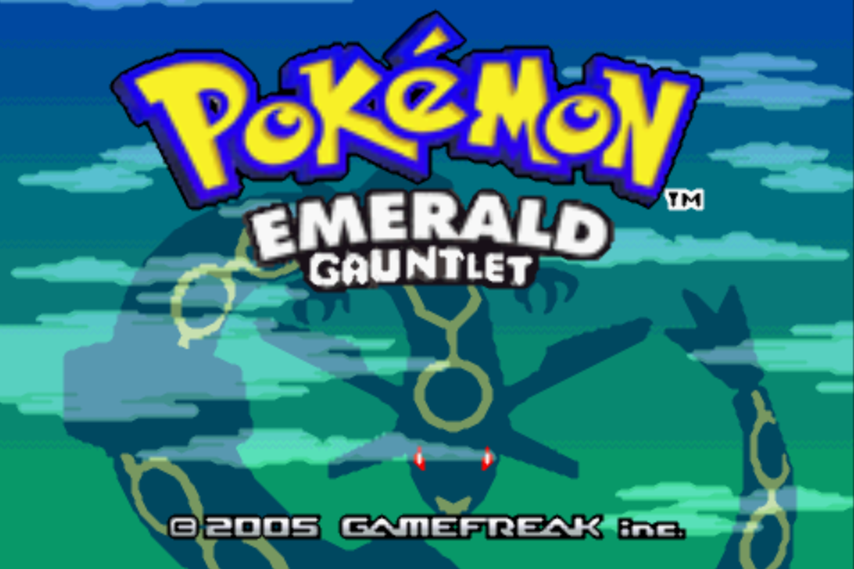
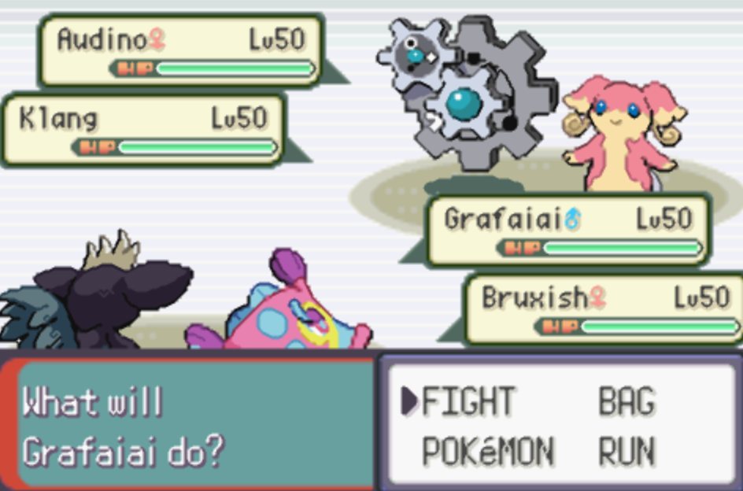
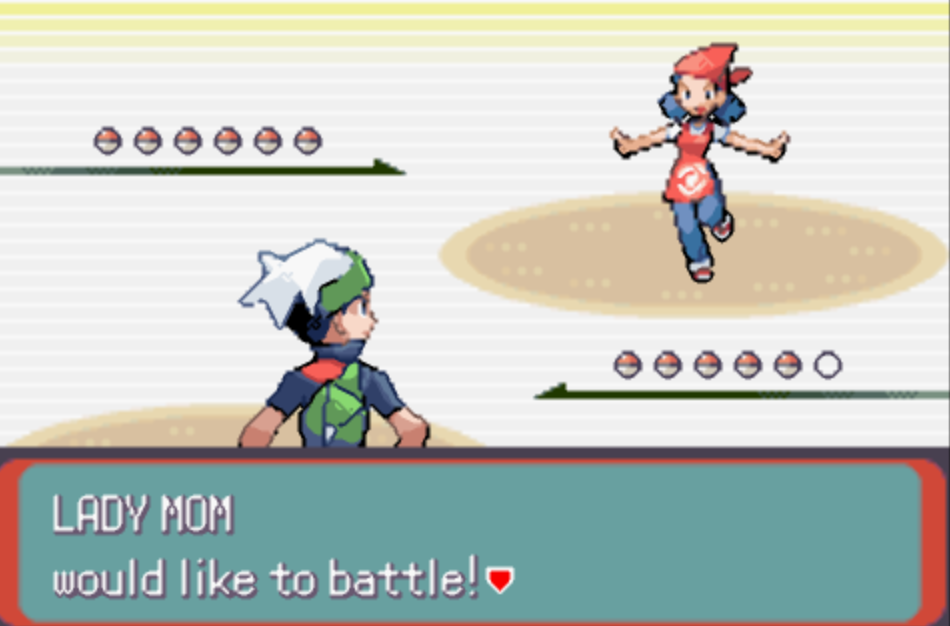
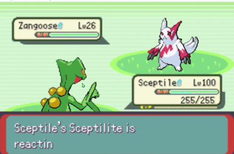
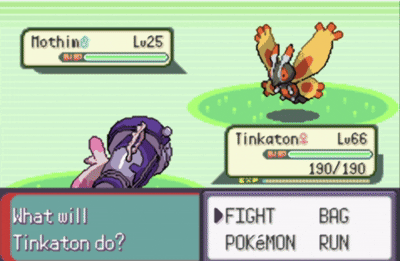
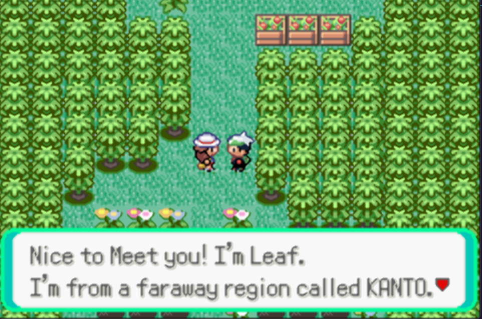

# 🎮 Emerald Gauntlet

A challenging ROM Hack of Pokemon Emerald designed for Nuzlocke runs, featuring intense gauntlets of battles with limited resources. Built using decomp hacking from Pokemerald Expansion.

---

## ✨ Features

- **⚔️ Intense Gauntlets** - Maps have been changed to be one-way / gauntlet-style routes
- **🎯 Gen 9 Pokemon & Moves** 
- **💎 Mega Evolutions** 
- **📊 Level Caps & Rare Candies** 
- **❄️ Gen 9 Mechanics** - Updated Snow weather mechanics and Frostbite status
- **👑 Harder Fights + Additional Boss Fights**
- **🔧 Pokemon Type & Stat changes** - Certain Pokemon got type changes & Stat boosts, like Sceptile being Grass/Dragon and meganium being Grass/Fairy
- **📝 Documentations** - Trainer Documentation, PokeMart Documentation, Item Documentations, Encounter Documentations out soon in Github!
- **⬆️ Changed Movepools** - Movepool and Learnset changes
- **🍒 Custom Berry Yields** - Yield Randomization for Berries

---

## 🎯 How to Play

1. **Download a GBA Emulator**
   - Recommended: VisualBoy Advance, mGBA, or any compatible GBA emulator
   
2. **Load the ROM**
   - Open `Emerald-Gauntlet(v1.0).gba` in your emulator
   
3. **Start Your Adventure!**

---

## Notes
1. **Save REGULARLY**
   - There has been bugs that could cause the game to crash, so please save regularly!

---

## 👤 Credits

**Created By:** Jereme Tan

**Source Code:** [pokeemerald-expansion](https://github.com/jerememetan/pokeemerald-expansion)

**ROM Base:** [Pokemerald-Expansion](https://github.com/rh-hideout/pokeemerald-expansion) by RH Hideout

**Expansion Version:** 1.7.4
---

## 📝 License

Based on Pokemerald-Expansion framework.

## 📸 Screenshots

  
  
  
  
  
  
   

